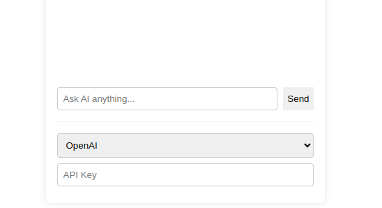

# 🚀 Penpot AI Assistant (Ollama Integration)

> 🎨 Supercharge your design workflow with AI-powered assistance!

## 🌟 Overview

Penpot AI Assistant seamlessly integrates local AI models through Ollama, bringing powerful AI capabilities directly into your design workflow - all while maintaining privacy and data security! 

## ✨ Features

- 🤖 Local AI processing with Ollama
- 🔒 Privacy-focused (your data stays on your machine)
- 🎯 Smart design suggestions
- 💡 Real-time creative assistance
- 🔄 Multiple AI model support
- ⚡ Lightning-fast responses

## 🎮 Quick Start

1. 📦 Install Ollama on your machine
2. 🔧 Install the plugin in Penpot
3. 🚀 Start designing with AI assistance!

## 🌈 Why It Matters

Design is evolving, and AI is leading the revolution! This plugin represents the future of design tools where human creativity meets artificial intelligence. By bringing AI directly into Penpot, we're:

- ⏱️ Reducing repetitive tasks
- 💪 Empowering designers to focus on creativity
- 🌍 Making professional design accessible to everyone

## 🔮 Future Impact

This is just the beginning! As AI models evolve, this plugin will:
- 🎯 Enable more intuitive design workflows
- 🤝 Bridge the gap between imagination and execution
- 🚀 Democratize professional design tools

## 🤝 Contributing

Join us in shaping the future of design! PRs and issues welcome.

## 📝 License

MIT - Let's build the future together! 🌟

---
Built with ❤️ for the Penpot community